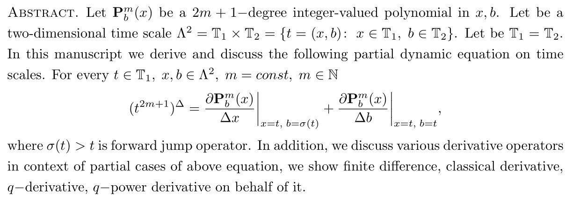

# A study on partial dynamic equation on time scales involving derivatives of polynomials

  

## What is all about

## How to use Mathematica package

- Open the package file `AStudyOnDinamicEquationsPackage.m` in Wolfram Mathematica, I use version 13.0
- Execute the package using `Shift+Enter`
- Open the notebook file `AStudyOnDynamicEquationsNotebook.nb`
- Execute the line: `Needs["AStudyOnDynamicEquations"]`
- Execute the line: `mainTheorem[m_] := Expand[timeScaleDerivativeX[m, t, sigma[t]] + timeScaleDerivativeB[m, t, t]]`
- Continue executing according to the guideline below

## Reproduce the results