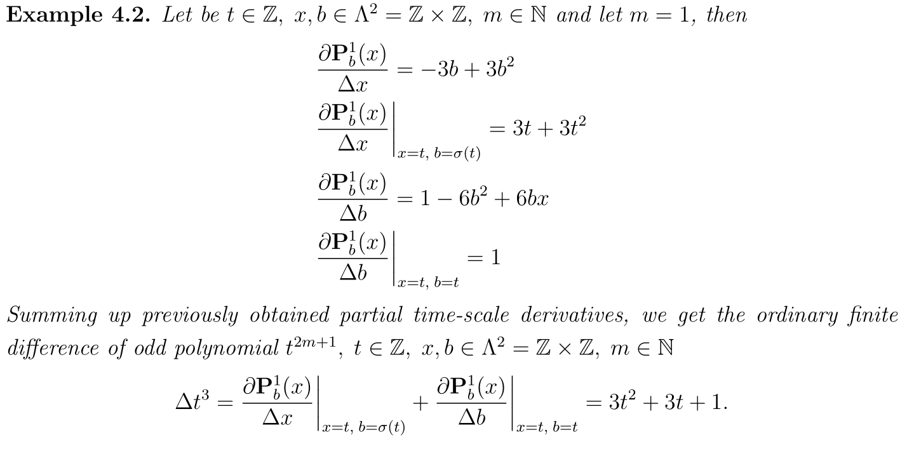
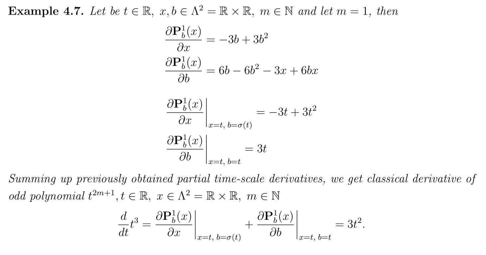

# A study on partial dynamic equation on time scales involving derivatives of polynomials

  

## What is all about

Source code of the manuscript entitled
"A study on partial dynamic equation on time scales involving derivatives of polynomials".

## How to use Mathematica package

- Open the package file `AStudyOnDinamicEquationsPackage.m` in Wolfram Mathematica, I use version 13.0
- Execute the package using `Shift+Enter`
- Open the notebook file `AStudyOnDynamicEquationsNotebook.nb`
- Execute the line: `Needs["AStudyOnDynamicEquations"]`
- Execute the line: `mainTheorem[m_] := Expand[timeScaleDerivativeX[m, t, sigma[t]] + timeScaleDerivativeB[m, t, t]]`
- Continue executing according to the guideline below

## Reproduce the results using Mathematica

Few examples of the outcomes of the manuscript and how to reproduce them

### Example for Z x Z time scale.

  

To reproduce example 4.2 proceed as follows with Mathematica:

- Set `sigma[x\_] := x + 1` in Mathematica package and execute definition.
- Execute `timeScaleDerivativeX[1, x, b]` which produces `-3 b + 3 b^2`.
- Execute `Expand[timeScaleDerivativeX[1, t, sigma[t]]]` which produces `3 t + 3 t^2`.
- Execute `timeScaleDerivativeB[1, x, b]` which produces `1 - 6 b^2 + 6 b x`.
- Execute `timeScaleDerivativeB[1, t, t]` which produces `1`.
- Execute `mainTheorem[1]` which produces `1 + 3 t + 3 t^2`.

### Example for R x R time scale.

  

To reproduce example 4.7 proceed as follows with Mathematica:

- Set `sigma[x\_] := x + Global`dx` in Mathematica package and execute definition.
- Execute `timeScaleDerivativeX[1, x, b]` which produces `-3 b + 3 b^2`.
- Execute `Limit[Expand[timeScaleDerivativeB[1, x, b]], dx -> 0]` which produces `6 b - 6 b^2 - 3 x + 6 b x`.
- Execute `timeScaleDerivativeX[1, t, t]` which produces `-3 t + 3 t^2`.
- Execute `Limit[Expand[timeScaleDerivativeB[1, t, t]], dx -> 0]` which produces `3t`.
- Execute `Limit[mainTheorem[1], dx -> 0]` which produces `3t^2`.